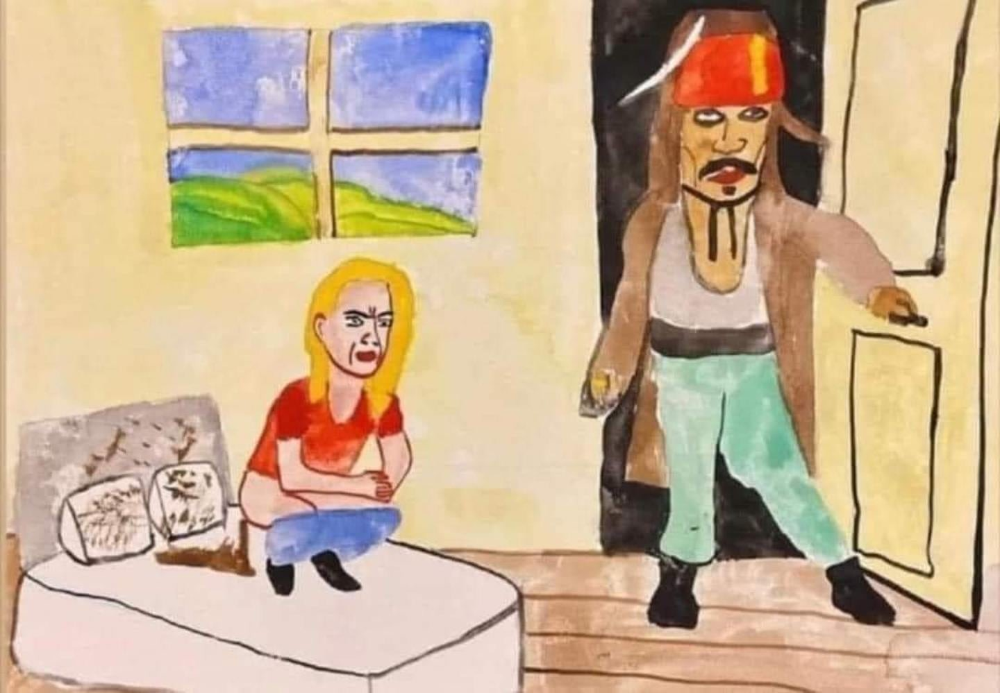
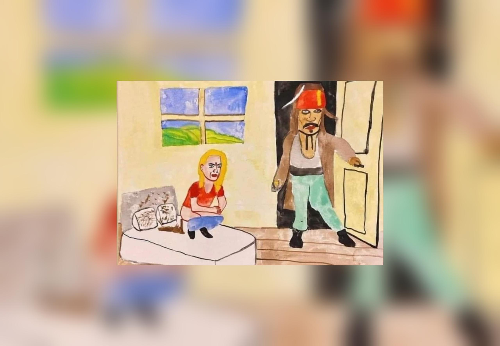

# Blur Paper
## Make a wallpaper with a blurry background and centered image.

Usage:

```
$ python3 blurpaper.py
```

or

```
$ ./blurpaper.py
```

Enter the path to your image and select a blur level to apply; ~ will resolve to your HOME folder.
Read the instructions on the screen, fairly simple to follow.

Here is an example of the input/output:

### Input:



### Output:



I don't have credit for the image, if you know please let me know so I can add it here, thanks.

*Requires PIL and python3.*
